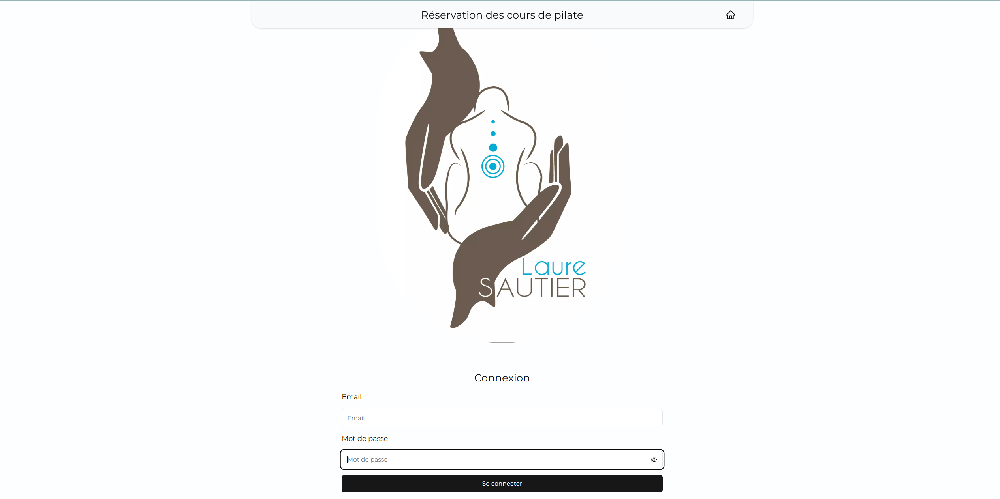

# Pilates Booking Platform

Bienvenue sur la plateforme de réservation de cours de Pilates ! Ce site a été développé pour faciliter la réservation et la gestion des cours de Pilates pour les utilisateurs et les administrateurs.

## 🌐 Démo



## 🛠️ Technologies utilisées

- **Framework Frontend** : [Next.js](https://nextjs.org/)
- **Framework CSS** : [Tailwind CSS](https://tailwindcss.com/)
- **Backend et Base de données** : [Supabase](https://supabase.com/)

## 🌟 Fonctionnalités principales

### Utilisateurs

- **Réserver des cours** : Les utilisateurs peuvent consulter les créneaux disponibles et réserver un cours de Pilates.
- **Visualiser les places disponibles** : Chaque créneau affiche le nombre de places restantes.
- **Annuler une réservation** : Les utilisateurs peuvent annuler une réservation depuis leur espace personnel.

### Administrateurs

- **Gestion des réservations** : Ajouter ou annuler des participants pour un cours.
- **Création de créneaux** : Créer de nouveaux créneaux pour les cours de Pilates.

## 📦 Installation

1. **Cloner le dépôt** :

   ```bash
   git clone https://github.com/jonathanbensadoun/Yoga-pilate-reservation
   ```

2. **Naviguer dans le répertoire** :

   ```bash
   cd pilates-booking
   ```

3. **Installer les dépendances** :

   ```bash
   npm install
   ```

4. **Configurer Supabase** :

   - Créez un projet sur [Supabase](https://supabase.com/).
   - Configurez la base de données et les tables nécessaires (voir le fichier `schema.sql` pour les détails).
   - Récupérez les clés API et mettez-les dans un fichier `.env.local` :
     ```env
     NEXT_PUBLIC_SUPABASE_URL=your-supabase-url
     NEXT_PUBLIC_SUPABASE_ANON_KEY=your-supabase-anon-key
     ```

5. **Lancer l'application** :
   ```bash
   npm run dev
   ```
   L'application sera disponible sur [http://localhost:3000](http://localhost:3000).

## 📂 Structure du projet

```
├── components       # Composants réutilisables
├── pages            # Pages Next.js
├── styles           # Fichiers CSS et Tailwind
├── utils            # Fonctions utilitaires
├── .env.local       # Variables d'environnement (non incluses dans le dépôt)
├── schema.sql       # Schéma de base de données pour Supabase
├── README.md        # Documentation du projet
```

## 🚀 Fonctionnalités futures

- Notifications par e-mail ou SMS pour rappeler les réservations.
- Intégration d'un système de paiement pour les réservations.
- Statistiques et rapports pour les administrateurs.

## 📝 Contribution

Les contributions sont les bienvenues !

1. Forkez le projet.
2. Créez une branche pour votre fonctionnalité :
   ```bash
   git checkout -b ma-nouvelle-fonctionnalite
   ```
3. Faites vos modifications et committez :
   ```bash
   git commit -m "Ajout d'une nouvelle fonctionnalité"
   ```
4. Poussez vos modifications :
   ```bash
   git push origin ma-nouvelle-fonctionnalite
   ```
5. Ouvrez une pull request.

## 📄 Licence

Ce projet est sous licence MIT. Consultez le fichier `LICENSE` pour plus de détails.

---

Merci d'utiliser notre plateforme de réservation de cours de Pilates ! Si vous avez des questions ou des suggestions, n'hésitez pas à nous contacter.
